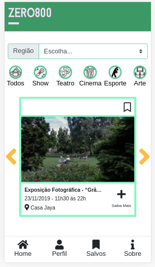

# Open House - Zero800

## Índice

* [1. Sobre o projeto](#1-Sobre-o-projeto)
* [2. Funcionalidades do projeto](#2-funcionalidade-do-projeto)
* [3. Tecnologias utilizadas](#3-tecnologias-utilizadas)

***

# 1. Sobre o projeto

O projeto Open House foi um desafio, pois foi planejado em equipe durante uma semana e codado em dois dias, aproximando-nos assim, do dia-a-dia de uma empresa. O objetivo é concentrar todos os eventos free de São Paulo em uma única plataforma, mantendo o site sempre atualizado, evitando poluição visual e abordando o maior número de diversidade cultural em todas as regiões. Dessa forma, podemos conectar o maior número de pessoas a cultura free e de qualidade. 

# 2. Funcionalidades do projeto

# Usuário:

- Em primeiro lugar, para encorajar as pessoas a frequentarem mais eventos gratuitos, a plataforma do Zero800 pretende conter avaliações e gameficação para encorajar o usuário a permanecer ativo, para isso, é necessário que ele se cadastre e logue na conta. Logando na conta, também poderá salvar os eventos Em segundo lugar, pensamos que todos devem disfrutar da cultura, mas que nem sempre é assim, pois São Paulo é muito grande e a distância desencoraja a participação. Então pensamos em um filtro por região e uma API para ajudar o usuário a se localizar melhor. Em terceiro lugar, separamos os eventos por categoria e por data, mantendo sempre atualizado para facilitar a navegação no site e evitar a poluição visual.

# Empresa:

- Para as empresas que organizam os eventos, pensamos em um cadastro específico para o anúncio do evento e em planos de pagamento de acordo com a quantidade e frequência de postagens. Também foi idealizado um termo de responsabilidade para a empresa sobre o teor do conteúdo postado.

# Nessa sprint o projeto está:

- Filtrando por regiões;
- Cadastrando usuário;
- Logando;
- Filtrando por região;
- Filtrando por categoria;
- Salvando o evento.

# 3. Tecnologias utilziadas

- Vanilla-JavaScript
- API HERE
- Firebase
- Bootstrap
- Css3
- HTML5
- Kanban e trello
